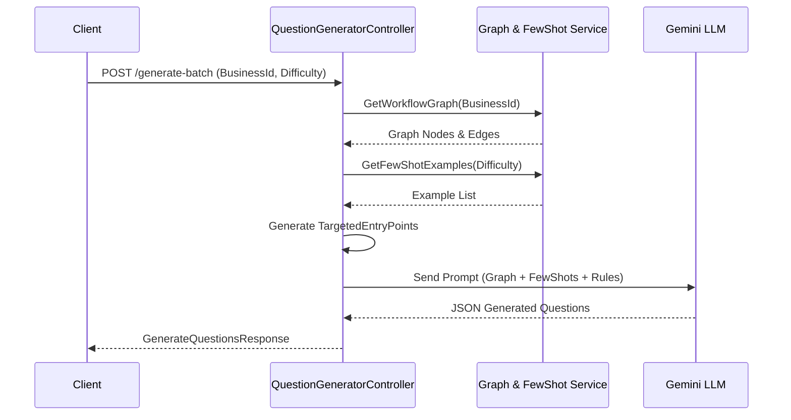

# Quy Trình Sinh Câu Hỏi Tự Động Từ Đồ Thị Mã Nguồn (Question Generation Workflow)

Tài liệu này mô tả chi tiết quy trình tự động sinh câu hỏi và đáp án dựa trên đồ thị mã nguồn (Workflow Graph). Hệ thống sử dụng các mô hình Ngôn ngữ Lớn (LLMs) kết hợp với các kỹ thuật Prompting tiên tiến để đảm bảo câu hỏi tạo ra bám sát logic nghiệp vụ của hệ thống.

## 1. Tổng Quan Quy Trình (Workflow Overview)

Quy trình sinh câu hỏi trải qua 4 giai đoạn chính:
1. **Trích xuất Đồ thị Nghiệp vụ (Graph Extraction)**: Lấy dữ liệu các hàm (Nodes) và luồng điều khiển (Edges) từ cơ sở dữ liệu.
2. **Lựa chọn Mẫu Few-Shot (Few-Shot Selection)**: Truy xuất các câu hỏi mẫu chất lượng cao để hướng dẫn LLM.
3. **Định tuyến Mục tiêu (Targeted Path Generation)**: Chọn ngẫu nhiên các nhánh trong đồ thị để ép LLM tạo câu hỏi bao phủ toàn diện.
4. **Sinh Câu hỏi (LLM Generation)**: Xây dựng Prompt và gọi Gemini LLM để sinh kết quả dưới dạng JSON.

---

## 2. Chi Tiết Các Giai Đoạn

### 2.1. Trích xuất Đồ thị Nghiệp vụ (Graph Extraction)
Khi có yêu cầu sinh câu hỏi cho một nghiệp vụ (Business ID), hệ thống sẽ truy vấn cơ sở dữ liệu để lấy ra các **Feature** và **Method** (Hàm) thuộc nghiệp vụ đó.
- **Nodes**: Đại diện cho các hàm (VD: `AppointmentController.CreateAppointment`).
- **Edges**: Đại diện cho sự gọi hàm hoặc luồng dữ liệu giữa các hàm.

> **Nền tảng Khoa học - Đồ thị Thuộc tính Mã nguồn (Code Property Graphs - CPG)**  
> **Nguồn trích dẫn**: *Yamaguchi, F., Golde, N., Arp, D., & Rieck, K. (2014). Modeling and Discovering Vulnerabilities with Code Property Graphs.*  
> **Nơi áp dụng**: Giai đoạn xây dựng cấu trúc đầu vào `WorkflowDataDto`.  
> **Điều bài báo chứng minh**: Việc biểu diễn mã nguồn dưới dạng đồ thị (kết hợp AST, Control-Flow Graph, và Data-Flow Graph) giúp nắm bắt toàn diện cả cấu trúc tĩnh lẫn luồng logic động, từ đó hỗ trợ việc phân tích và truy vấn các ngữ cảnh phức tạp trong mã nguồn hiệu quả hơn nhiều so với phân tích văn bản thuần túy.

### 2.2. Lựa chọn Mẫu Few-Shot (Few-Shot Selection)
Hệ thống truy vấn cơ sở dữ liệu để lấy ra $N$ mẫu câu hỏi chuẩn (Few-shot examples) tương ứng với độ khó và miền nghiệp vụ. Các mẫu này được nhúng trực tiếp vào Prompt để làm "khuôn mẫu" cho LLM học theo.

> **Nền tảng Khoa học - Few-Shot Prompting (In-Context Learning)**  
> **Nguồn trích dẫn**: *Brown, T., et al. (2020). Language Models are Few-Shot Learners. (NeurIPS).*  
> **Nơi áp dụng**: Dịch vụ `FewShotService` khi chuẩn bị Prompt cho LLM.  
> **Điều bài báo chứng minh**: Các LLM lớn có khả năng "học trong ngữ cảnh" (In-Context Learning). Việc cung cấp từ 1 đến vài ví dụ (Few-Shot) trực tiếp trong prompt giúp cải thiện đột phá khả năng tuân thủ định dạng (như JSON) và định hình phong cách phản hồi của mô hình mà không cần phải tinh chỉnh (Fine-tuning) lại trọng số.

### 2.3. Khởi tạo Prompt (Prompt Engineering)
Hệ thống tổng hợp tất cả thành phần trên thành một Prompt hoàn chỉnh:
- **System Instruction**: Đóng vai trò là Giảng viên Đại học (System Analyst) và áp dụng các quy tắc nghiêm ngặt về ngôn ngữ (100% Business Language, cấm dùng từ khóa code).
- **Quy định Độ khó**: Ép LLM sinh câu hỏi dựa trên số lượng luồng ngoại lệ (Happy Path, Single Exception, Double Exception).
- **Context**: Chuỗi các đoạn Code thực tế và Sơ đồ luồng (Data Mermaid Graph).
- **Few-Shot Examples**: Các ví dụ mẫu để LLM tham khảo.

### 2.4. Sinh Câu hỏi và Định tuyến Mục tiêu (Targeted Entry Points)
Gọi API của Google Gemini để nhận kết quả. Điều đặc biệt ở đây là bên cạnh việc sinh ra câu hỏi, Gemini LLM bị ép buộc (thông qua prompt) phải **tự phân tích ngược lại mã nguồn** để trích xuất ra một mảng `TargetedEntryPoints`. 

#### Tầm quan trọng của TargetedEntryPoints (Điểm neo Mục tiêu)
`TargetedEntryPoints` (hoặc TargetPoint) là một mảng tuần tự chứa danh sách đích danh các hàm trong Call Stack (từ `Controller` -> `Interface Service` -> `Implementation` -> `Repository`) đóng vai trò giải quyết trực tiếp tình huống nghiệp vụ được nêu trong câu hỏi.

Ví dụ, khi LLM sinh ra một câu hỏi về "tạo lịch hẹn", nó bắt buộc phải xuất ra kèm theo:
```json
"targetedEntryPoints": [
  "AppointmentController.CreateAppointmentForCustomer",
  "IAppointmentService.CreateAppointment",
  "AppointmentService.CreateAppointment"
]
```

**Vai trò cốt lõi của TargetedEntryPoints:**
1. **Ép LLM suy nghĩ có cơ sở (Grounding)**: Việc bắt LLM phải tự chỉ ra nó đang hỏi về đoạn code nào ép buộc mô hình không được "bịa" (hallucinate) ra các tình huống ảo. Nó phải nhìn thấy hàm đó trong mã nguồn thì mới được quyền đặt câu hỏi.
2. **Cầu nối sang pha Đánh giá (Assessment Bypass)**: Thay vì phải dùng kỹ thuật Nhúng Vector (Vector Search) tốn kém và có độ trễ cao để dò tìm lại xem câu hỏi này thuộc về hàm nào trong Đồ thị, hệ thống đánh giá chỉ cần lấy mảng `TargetedEntryPoints` này và khớp chuỗi trực tiếp (Lenient String Matching) vào Đồ thị. Tốc độ tìm kiếm giảm xuống O(1) và độ chính xác đạt tuyệt đối (100%).

> **Nền tảng Khoa học - Chain of Thought (CoT) Prompting & Grounding**  
> **Nguồn trích dẫn**: *Wei, J., et al. (2022). Chain-of-Thought Prompting Elicits Reasoning in Large Language Models. (NeurIPS).*  
> **Nơi áp dụng**: Việc yêu cầu LLM vừa sinh câu hỏi vừa phải định vị chuỗi `TargetedEntryPoints`.  
> **Điều bài báo chứng minh**: Ép LLM phải suy nghĩ theo từng bước hoặc liệt kê rõ ràng các dẫn chứng logic (như các hàm trong Call Stack) trước/trong khi đưa ra kết quả cuối cùng giúp tăng đột phá khả năng lập luận và độ tin cậy của mô hình, ngăn chặn hiện tượng sinh dữ liệu thiếu cơ sở.

---

## 3. Sơ đồ Luồng (Sequence Diagram)


